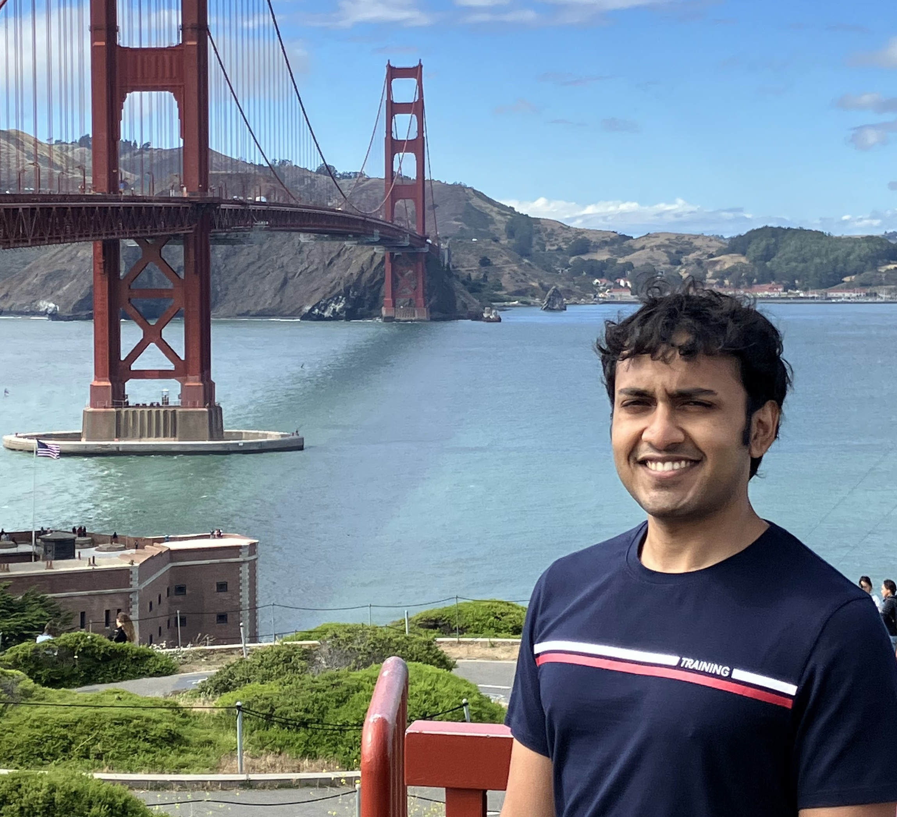

## About Me

Hi! I am a first year PhD student of Computer Science at the [National University of Singapore](https://www.comp.nus.edu.sg).

I broadly work in the field of Logic and Probabilistic Reasoning. I am currently working on verifying probabilistic programs.

## Research Interests

SAT 

Property Testing 

Probabilistic Reasoning

## Publications

1. Yash Pote, Saurabh Joshi, Kuldeep S. Meel: *[Phase Transition Behaviour of Cardinality and XOR Constraints](https://arxiv.org/abs/1910.09755)* (IJCAI-19) *[abstract](https://meelgroup.github.io/publication/ijcai19_cardxor/)*,*[cite](https://meelgroup.github.io/publication/ijcai19_cardxor/)*,*[slides](https://meelgroup.github.io/files/slides/ijcai19pjm.pdf)*

2. Kuldeep S. Meel &reg; Yash Pote &reg; Sourav Chakraborty: *[On Testing of Samplers](https://arxiv.org/abs/2010.12918)* (NeuRIPS-20) *[abstract](https://meelgroup.github.io/publication/neurips20_testing/)*,*[cite](https://meelgroup.github.io/publication/neurips20_testing/)*

## Posts

Some stuff I have written.

Year | Title                                                            | Relvant Papers
-----|------------------------------------------------------------------|--------------------
2019 | [Phase Transitions and Counting](https://yashpote.com/parity.md) | [1],[a](), [b](), [c](), [d]()
2020 | [Sampling](https://yashpote.com/testing.md)                      | [2],[e]()

---

## Collaborators

* [Kuldeep S. Meel](https://www.comp.nus.edu.sg/~meel/): NUS 
* [Saurabh Joshi](https://sbjoshi.github.io/): IIT-H
* [Sourav Chakraborty](https://https://www.isical.ac.in/~sourav/): ISI
* [Durgesh Agarwal](https://durgeshra.github.io/): IIT-K

## Research Group

I work in the [Meel Research Group](https://meelgroup.github.io/). We are situated in the School of Computing in NUS. 
