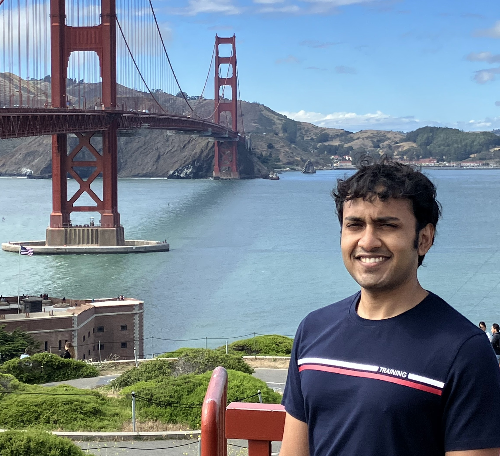

I am a Research Fellow (postdoc) at the [National University of Singapore](https://www.comp.nus.edu.sg), where I am advised by [Jonathan Scarlett](https://www.comp.nus.edu.sg/~scarlett/). I completed my Ph.D. at NUS, where I was advised by [Kuldeep S. Meel](https://www.cs.toronto.edu/~meel/). Prior to that I received a B.Tech. in Computer Science and Engineering from IIT-Guwahati.

I'm broadly interested in the theory and practice of *probabilistic formal methods*. Most of my work is on developing techniques in *distribution testing* with the aim of faster verification tools for real-world distributions, such as samplers, generative models, and bandits. More generally, I am interested in the use of formal methods (like *combinatorial solving*) in machine learning.

Here is my [CV](cv-yash.pdf). You can reach me at [yashppote@gmail.com](mailto:yashppote@gmail.com).

---

## Selected Publications

    <a href="https://doi.org/10.1609/aaai.v39i11.33231">Towards Real-Time Approximate Counting</a>
    (AAAI-25) 
    <strong>Yash Pote</strong> &reg; Kuldeep S. Meel &reg; Jiong Yang
    <em>Selected for oral presentation (4.6% of submitted papers)</em> 

    <a href="https://arxiv.org/abs/2506.20197v1">Zero-Shot Attribution for Large Language Models: A Distribution Testing Approach</a>
    (Under Submission) 
    Clément L. Canonne, <strong>Yash Pote</strong>, Uddalok Sarkar
    <a href="https://github.com/uddaloksarkar/anubis" class="badge">code</a>

    <a href="https://arxiv.org/abs/2306.13958">On Scalable Testing of Samplers</a>
    (NeurIPS-22) 
    <strong>Yash Pote</strong> &reg; Kuldeep S. Meel
    <a href="https://github.com/meelgroup/barbarik" class="badge">code</a>

---

## All Publications
&reg; indicates random author ordering.

Click to view full list

### Distribution Testing

    [14] <a href="https://arxiv.org/abs/2512.08376">A Distribution Testing Approach to Clustering Distributions</a> 
    Gunjan Kumar, <strong>Yash Pote</strong>, Jonathan Scarlett

    [13] <a href="https://arxiv.org/abs/2506.20197v1">Zero-Shot Attribution for Large Language Models: A Distribution Testing Approach</a>
    (Under Submission) 
    Clément L. Canonne, <strong>Yash Pote</strong>, Uddalok Sarkar
    <a href="https://github.com/uddaloksarkar/anubis" class="badge">code</a>

    [12] <a href="https://arxiv.org/abs/2512.06458v1">Instance Dependent Testing of Samplers using Interval Conditioning</a> 
    Rishiraj Bhattacharyya, Sourav Chakraborty, <strong>Yash Pote</strong>, Uddalok Sarkar, Sayantan Sen
    <a href="https://github.com/uddaloksarkar/lachesis" class="badge">code</a>

    [11] <a href="https://arxiv.org/abs/2505.12107">Learning Probabilistic Temporal Logic Specifications for Stochastic Systems</a>
    (IJCAI-25) 
    Rajarshi Roy, <strong>Yash Pote</strong>, David Parker, Marta Kwiatkowska

    [10] <a href="https://arxiv.org/abs/2308.04264">Distance Estimation for High-Dimensional Discrete Distributions</a>
    (AISTATS-25) 
    Gunjan Kumar &reg; Kuldeep S. Meel &reg; <strong>Yash Pote</strong>

    [9] <a href="https://arxiv.org/abs/2312.10999">Testing Self-Reducible Samplers</a>
    (AAAI-24) 
    Rishiraj Bhattacharyya, Sourav Chakraborty, <strong>Yash Pote</strong>, Uddalok Sarkar, Sayantan Sen
    <a href="https://github.com/uddaloksarkar/cubeprobe" class="badge">code</a>

    [8] <a href="https://arxiv.org/abs/2306.13958">On Scalable Testing of Samplers</a>
    (NeurIPS-22) 
    <strong>Yash Pote</strong> &reg; Kuldeep S. Meel
    <a href="https://github.com/meelgroup/barbarik" class="badge">code</a>

    [7] <a href="https://arxiv.org/abs/2112.04941">Testing Probabilistic Circuits</a>
    (NeurIPS-21) 
    <strong>Yash Pote</strong> &reg; Kuldeep S. Meel
    <a href="https://github.com/meelgroup/teq" class="badge">code</a>

    [6] <a href="https://arxiv.org/abs/2010.12918">On Testing of Samplers</a>
    (NeurIPS-20) 
    Kuldeep S. Meel &reg; <strong>Yash Pote</strong> &reg; Sourav Chakraborty
    <a href="https://meelgroup.github.io/files/slides/Neurips20-MPC.pdf" class="badge">slides</a>
    <a href="https://slideslive.com/38936618/on-testing-of-samplers?ref=account-81660-history" class="badge">video</a>
    <a href="https://github.com/meelgroup/barbarik" class="badge">code</a>

### Combinatorial Solving

    [5] <a href="https://doi.org/10.1609/aaai.v39i11.33231">Towards Real-Time Approximate Counting</a>
    (AAAI-25) 
    <strong>Yash Pote</strong> &reg; Kuldeep S. Meel &reg; Jiong Yang
    <em>Selected for oral presentation (4.6% of submitted papers)</em>

    [4] <a href="https://arxiv.org/abs/2105.11132">Partition Function Estimation: A Quantitative Study</a>
    (IJCAI-21) 
    Durgesh Agrawal, <strong>Yash Pote</strong>, Kuldeep S. Meel
    <a href="https://yashpote.github.io/files/posters/ijcai21.pdf" class="badge">poster</a>

    [3] <a href="https://arxiv.org/abs/1910.09755">Phase Transition Behaviour of Cardinality and XOR Constraints</a>
    (IJCAI-19) 
    <strong>Yash Pote</strong>, Saurabh Joshi, Kuldeep S. Meel
    <a href="https://github.com/meelgroup/1-CARD-XOR" class="badge">code</a>
    <a href="https://meelgroup.github.io/files/slides/ijcai19pjm.pdf" class="badge">slides</a>
    <a href="https://www.youtube.com/watch?v=uUZapkZOLYE" class="badge">video</a>

### DNA Data Storage

    [2] <a href="https://arxiv.org/abs/2212.13447">Efficiently Supporting Hierarchy and Data Updates in DNA Storage</a>
    (MICRO-23) 
    Puru Sharma, Cheng-Kai Lim, Dehui Lin, <strong>Yash Pote</strong>, Djordje Jevdjic

    [1] <a href="https://arxiv.org/abs/2204.12261">Managing Reliability Skew in DNA Storage</a>
    (ISCA-22) 
    Dehui Lin, Yasamin Tabatabaee, <strong>Yash Pote</strong>, Djordje Jevdjic

